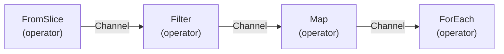
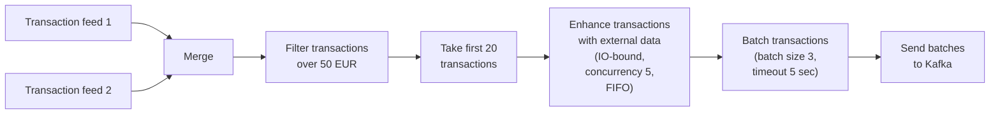

# JPipe

[](https://goreportcard.com/report/github.com/junitechnology/jpipe)
[](https://tip.golang.org/doc/go1.18)
[](https://junitechnology.github.io/jpipe/)
[](https://pkg.go.dev/github.com/junitechnology/jpipe)
[](https://opensource.org/licenses/MIT)

A user-friendly implementation of the [pipeline pattern](https://go.dev/blog/pipelines) in Go.

## Overview

The pipeline pattern has been described by members of the core Go team several times:

- [Go Concurrency Patterns: Pipelines and cancellation](https://go.dev/blog/pipelines)
- [Google I/O 2012 - Go Concurrency Patterns](https://www.youtube.com/watch?v=f6kdp27TYZs)
- [Advanced Go Concurrency Patterns](https://go.dev/blog/io2013-talk-concurrency)

Go provides very powerful concurrency primitives, but implementing the pipeline pattern correctly,
with a correct handling of cancellation, requires a very good understanding of those primitives, and some non-negligible amount of boilerplate code. As pipelines become more complex, that boilerplate also starts to weigh heavily on code readability. Enter JPipe.

### Features

- Simple, controlled, per-operator concurrency
- Ordered FIFO-like concurrency
- Asynchronous execution and API
- Safe context-based cancellation
- Type-safe API
- Fluent API (as much as allowed by Go generics)

### Model

A `Pipeline` is a directed acyclic graph(DAG), where *operator*s are nodes and `Channel`s are edges:



JPipe has the classic operators `Map`, `Filter`, `ForEach` and many more. Operators may have options. In particular, operators that take a function as parameter(e.g. `Map`) usually support concurrency, which applies only to that operator, and not the whole pipeline. This allows for fine-grained concurrency control.

Operators are not necessarily linear, so they may have multiple input/output `Channel`s. `Merge` e.g. takes several inputs and merges them into a single output.

`Channel`s are just a light wrapper over a plain Go channel, and you can reason about them in the same way you do with Go channels. The only exception is that a `Channel` can only be input to one operator.

## Usage

Assume we have an expensive IO operation that takes 1 second to execute:

```go
func expensiveIOOperation(id int) {
    time.Sleep(time.Second)
}
```

Imagine this operation must be run for ids 1 through 10. We don't want to wait 10 seconds though, so we decide to do it with a concurrency factor of 5, expecting to get the full operation down to 2 seconds. The full Go code for that would be:

<details>
<summary markdown="span">Plain Go version</summary>

```go
ids := []int{1, 2, 3, 4, 5, 6, 7, 8, 9, 10}
channel := make(chan int)
concurrency := 5
var wg sync.WaitGroup
for i := 0; i < concurrency; i++ {
  wg.Add(1)
  go func() {
    defer wg.Done()
    for id := range channel {
      expensiveIOOperation(id)
    }
  }()
}

outer:
for _, id := range ids {
  select {
  // The nested select gives priority to the ctx.Done() signal, so we always exit early if needed
  // Without it, a single select just has no priority, so a new value could be processed even if the context has been canceled
  case <-ctx.Done():
    break outer
  default:
    select {
    case channel <- id:
    case <-ctx.Done(): // always check ctx.Done() to avoid leaking the goroutine
      break outer
    }
  }
}
close(channel)

wg.Wait()
```

</details>

That's a lot of code right there for a simple work pool! We even had to make it collapsable to avoid disrupting the reading flow. Admittedly, most of the complexity comes from cancellation handling, but you don't want to go around leaking your goroutines. Now let's see how the same thing is done with JPipe:

```go
ids := []int{1, 2, 3, 4, 5, 6, 7, 8, 9, 10}
pipeline := jpipe.New(ctx)
<-jpipe.FromSlice(pipeline, ids).
    ForEach(expensiveIOOperation, jpipe.Concurrent(5))
```

### Complex pipelines

The above is a simple work pool and admittedly the most common use case you'll find for concurrency. But JPipe allows you to build more complex pipelines with its catalog of operators. Imagine the following processing pipeline:



The JPipe implementation would be:

```go
pipeline := jpipe.New(ctx)
feed1 := jpipe.FromGoChannel(pipeline, getTransactionsFromFeed("feed1"))
feed2 := jpipe.FromGoChannel(pipeline, getTransactionsFromFeed("feed2"))

txs := jpipe.Merge(feed1, feed2).
    Filter(func(ft FeedTransaction) bool { return ft.Amount > 50 }).
    Take(20)

enhancedTxs := jpipe.Map(txs, enhanceTransaction, jpipe.Concurrent(4), jpipe.Ordered(10))
<-jpipe.Batch(enhancedTxs, 3, 5*time.Second).
    ForEach(sendTransactionBatchToKafka)
```

## Documentation

You can find much more details on our [official documentation](https://junitechnology.github.io/jpipe/). Some useful links in there:

- [Usage](https://junitechnology.github.io/jpipe/docs/usage.html)
- [Concurrency](https://junitechnology.github.io/jpipe/docs/usage/concurrency.html)
- [Cancellation](https://junitechnology.github.io/jpipe/docs/usage/cancellation.html)
- [Operators reference](https://junitechnology.github.io/jpipe/docs/operators.html)

You can also check the [Go.Dev reference](https://pkg.go.dev/github.com/junitechnology/jpipe).

## Similar projects

- [RxGo](https://github.com/ReactiveX/RxGo): Probably the best alternative out there, with lots of operators. It hasn't seen action in two years though, so it hasn't adopted generics: the API still deals with interface{}. A potential drawback for Go developers is its use of the reactive model, which is an abstraction very different from Go channels, and requires understanding of concepts like observer, observable, backpressure strategies, etc. If you'd rather stay within Go's channel abstraction, JPipe may be simpler to use, but RxGo may be your preferred choice if you have a background with the reactive model from other languages.
- [pipeline](https://github.com/deliveryhero/pipeline): An implementation of the pipeline pattern, but with a limited set of operators. It hasn't adopted generics yet either.
- [parapipe](https://github.com/nazar256/parapipe): A very simple pipeline implementation, but it has a single `Pipe` operator and does not support very complex pipelines. It hasn't adopted generics yet either.
- [ordered-concurrently](https://github.com/tejzpr/ordered-concurrently): An implementation of ordered concurrency. It doesn't try to be a complete pipeline pattern library though, and just focuses on that feature.

## License

JPipe is open-source software released under the [MIT License](LICENSE).