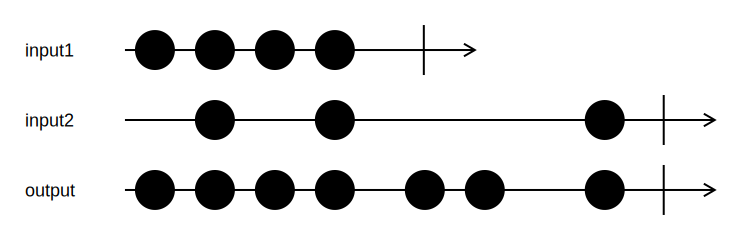

<h1>Concat</h1>

```go
Concat[T any](inputs ...*Channel[T]) *Channel[T]
```

`Concat` concatenates multiple input channels to a single output channel.
Channels are consumed in order, e.g., the second channel won't be consumed until the first channel is closed.

<h2>Example</h2>

```go
output := Concat(input1, input2)
```
{:class="img-responsive"}