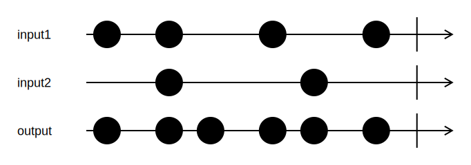

<h1>Merge</h1>

```go
Merge[T any](inputs ...*Channel[T]) *Channel[T]
```

`Merge` merges multiple input channels to a single output channel.
Values from input channels are sent to the output channel as they arrive, with no specific priority.

<h2>Example</h2>

```go
output := Merge(input1, input2)
```
{:class="img-responsive"}