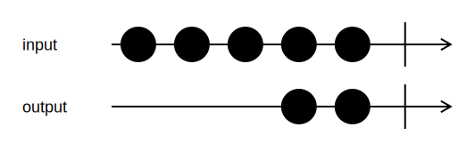

<h1>Take</h1>

```go
func (input *Channel[T]) Skip(n uint64) *Channel[T]
```

`Skip` skips the first `n` input values, and then starts sending values from `n+1` on to the output channel.

<h2>Example</h2>

```go
output := input.Skip(3)
```
{:class="img-responsive"}