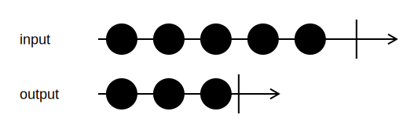

<h1>Take</h1>

```go
func (input *Channel[T]) Take(n uint64)
```

`Take` sends the first `n` input values to the output channel, and then stops processing input and closes the output channel.

<h2>Example</h2>

```go
output := input.Take(3)
```
{:class="img-responsive"}