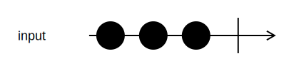

<h1>ForEach</h1>

```go
func (input *Channel[T]) ForEach(function func(T), opts ...options.ForEachOption) <-chan struct{}
```

`ForEach` calls the function passed as parameter for every value coming from the input channel.

The returned channel will close when all input values have been processed, or the pipeline is canceled.

<h2>Example</h2>

```go
<-input.ForEach(func(x int) { fmt.Println(x)})
```
{:class="img-responsive"}
```
Console output:
1
2
3
```