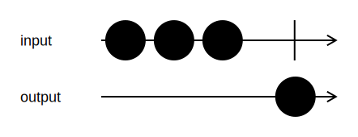

<h1>None</h1>

```go
func (input *Channel[T]) None(predicate func(T) bool) <-chan bool
```

`None` determines if no input value matches the predicate.

If no value matches the predicate, `true` is sent to the returned channel when all input values have been processed, or the pipeline is canceled.

If instead some value matches the predicate, `false` is immediately sent to the returned channel and no more input values are read.

<h2>Examples</h2>

```go
input.None(func(value int) bool { return value > 3 })
```
{:class="img-responsive"}

```go
output := input.None(func(value int) bool { return value >= 2 })
```
{:class="img-responsive"}