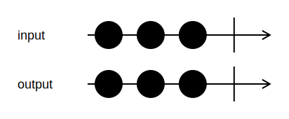

<h1>ToGoChannel</h1>

```go
func (input *Channel[T]) ToGoChannel() <-chan T
```

`ToGoChannel` sends all values from the input channel to the returned Go channel.

The returned Go channel closes when all input values have been processed, or the pipeline is canceled.

<h2>Example</h2>

```go
output := input.ToGoChannel()
```
{:class="img-responsive"}