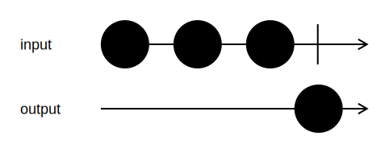

<h1>ToSlice</h1>

```go
func (input *Channel[T]) ToSlice() <-chan []T
```

`ToSlice` puts all values coming from the input channel in a slice.

The resulting slice is sent to the returned channel when all input values have been processed, or the pipeline is canceled.

<h2>Example</h2>

```go
output := input.ToSlice()
```
{:class="img-responsive"}