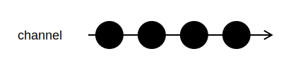

<h1>FromGenerator</h1>

```go
func FromGenerator[T any](pipeline *Pipeline, generator func(i uint64) T) *Channel[T]
```

`FromGenerator` creates a `Channel` from a stateless generator function.
Values returned by the function are sent to the channel in order.

<h2>Example</h2>

```go
channel := FromGenerator(pipeline, func(i int64) int64 { return i * 10 })
```
{:class="img-responsive"}