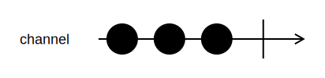

<h1>FromSlice</h1>

```go
func FromSlice[T any](pipeline *Pipeline, slice []T) *Channel[T]
```

`FromSlice` creates a `Channel` from a slice.
All values in the slice are sent to the channel in order.

<h2>Example</h2>

```go
channel := FromSlice(pipeline, []int{1,2,3})
```
{:class="img-responsive"}