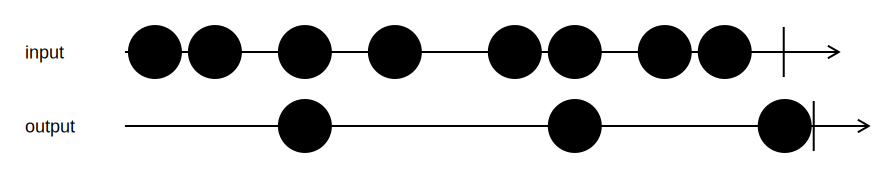

<h1>Batch</h1>

```go
func Batch[T any](input *Channel[T], size int, timeout time.Duration) *Channel[[]T]
```

`Batch` batches input values in slices and sends those slices to the output channel.
Batches are closed and sent to the output when one of these three conditions are met:

- The size of the batch reaches `size`
- The time elapsed since the last batch(or the start) reaches `timeout`
- The input channel is closed

Both parameters are ignored if they are 0.
In that case, only the related condition above is not taken into consideration.

<h2>Example</h2>

```go
output := Batch(input, 3, 0)
```
{:class="img-responsive"}