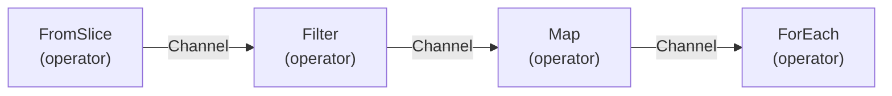

<h1>Usage</h1>

JPipe is built with several principles in mind:

- **Type safety:** All pipeline operators must be type safe. Go generics allow us to do this, so there must be no instances of `interface{}` in the API.
- **Safe cancellation:** JPipe must guarantee safe cancellation of pipelines, and ensure no goroutines are leaked.
- **Asynchronous operation:** Pipeline operators must execute asynchronously. Reading output data from the pipeline also has to be possible asynchronously.
- **Concurrency:** It must be easy to set the concurrency of pipeline operators.
- **Lazy execution:** Pipeline operators must start working only when the pipeline itself starts.
- **Fluent API:** The API must be fluent, allowing to create pipelines with chained operators as a single statement. This is done on best effort, cause some operators just can't be made chainable with the current Go generics implementation.
- **Non-intrusive operator options:** Operator options must be optional(variadic) and not passing options should render the logically default behavior of the operator. This makes the library easier for users who don't care about tuning operator options.
- **Channel-centric:** The main abstraction of the library is the `Channel`, which is just a wrapper for a Go channel. We don't want to introduce additional abstractions like e.g. observers/observables, cause that would force Go developers to learn a new concurrency paradigm.

<h2>Basic concepts</h2>

JPipe revolves around three basic concepts: `Pipeline`, `Channel` and *operator*.

- **Pipelines**: A `Pipeline` is a container for the classic [Pipelines and Cancellation](https://go.dev/blog/pipelines) pattern. It works as a coordinator or context for multiple *operators* and `Channel`s.
- **Channels**: A `Channel` is a wrapper for a Go channel. It is the means of passing data between two *operator*s. It provides chainable methods to construct pipelines, but conceptually it must be seen as a nothing but an enhanced Go channel.
- **Operators**: An *operator* or *node* is a step in the pipeline. It receives data from input `Channel`s, processes it and sends data to output `Channel`s.

A `Pipeline` is more easily thought of as a directed acyclic graph(DAG), where *operator*s are nodes and `Channel`s are edges:



<h3>Operator types</h3>

There are two special types of operators:

- **Source:** Source operators generate data into the pipeline. They have no inputs and one output `Channel`. In DAG terms, they are root nodes.
- **Sink:** Sink operators consume data from the pipeline. They have one input and no output `Channel`s. Processed data is yielded by the operator on a Go channel, but this is not part of the `Pipeline` anymore. In DAG terms, sink operators are leaf nodes.

The rest of the operators are intermediate operators. They have at least one input and at least one output. Intermediate operators can be further classified in *combination*, *filtering*, *transformation* and *utility* operators, but that's not relevant at this point.

<h2>Creating a pipeline</h2>

Creating a pipeline is as simple as:

```go
pipeline = jpipe.New(ctx)
```

The above creates a pipeline that gets automatically canceled when the context is canceled. The pipeline will automatically start the moment a sink operator is created on it.

If you need more control over the pipeline behaviour, you can use:

```go
pipeline = jpipe.NewPipeline(jpipe.Config{
    Context: ctx,
    StartManually: true
})
```

The passed context can be `nil`, and in that case, no automatic cancelation will happen. Cancelation can be triggered manually though, by calling `pipeline.Cancel()`.

If `StartManually` is `true`, the pipeline won't start until `pipeline.Start()` is called. This can be useful in complex pipelines with several sink operators, if you want to ensure that all pipeline operators will start simultaneously.

`pipeline.Done()` can be used to check whether the pipeline has stopped. It's similar to `context.Done()`. Once done, `pipeline.Error()` can be used to check if there was an error in the pipeline.

<h2>Generating data</h2>

Data is injected into the pipeline with source operators. A common way to generate data is by starting from a slice:

```go
channel := jpipe.FromSlice(pipeline, []int{ 1, 2, 3, 4, 5})
```

The above snippet created a `Channel` from a slice. No work is being done yet, data will only flow through that channel when the `Pipeline` starts.

<h2>Processing data</h2>

Intermediate operators process data from one(or more) input channels to one(or more) output channels. Take e.g. the simple `Filter` operator, which discards data that does not match a predicate function. The following only passes through odd numbers:

```go
channel := channel.Filter(func(x int) bool { return x % 2 == 1 })
```

`Filter` is actually a method on the `Channel` type, so it's a chainable operator. Unfortunately, not all operators are chainable, because of limitations in Go generics. The `classic` Map isn't:

```go
channel :=  jpipe.Map(channel, func(x int) int { return x * 10 })
```

<h2>Consuming data</h2>

Data is consumed from the pipeline with sink operators. The simplest sink operator is `ForEach`, which just runs a function for each input value:

```go
result :=  channel.ForEach(func(x int) { fmt.Printf("Processing %d\n", x) })
```

The returned `result` is a Go channel that will close when either all values have been processed, or the pipeline is canceled. Having it be a Go channel makes the `ForEach` method asynchronous, so we don't have to wait for it to complete, and we can do other things. Many times though, we actually want to wait for it to complete, so we just do this:

```go
<-channel.ForEach(func(x int) { fmt.Printf("Processing %d\n", x) })
```

And finally let's add some concurrency to it just to showcase the feature:

```go
<-channel.ForEach(func(x int) { fmt.Printf("Processing %d\n", x) }, jpipe.Concurrent(2))
```

<h2>Putting it all together</h2>

Now let's run all the above steps in a single pipeline:

```go
ctx := context.Background()
pipeline = jpipe.New(ctx)
channel := jpipe.FromSlice(pipeline, []int{ 1, 2, 3, 4, 5}).
    Filter(func(x int) bool { return x % 2 == 1 })
<-jpipe.Map(channel, func(x int) int { return x * 10 }).
    ForEach(func(x int) { fmt.Printf("Processing %d\n", x) }, jpipe.Concurrent(2))

if err := pipeline.Error(); err != nil {
    fmt.Printf("Error in pipeline %v\n", err)
}
```
```
Console output:
Processing 10
Processing 50
Processing 30
```

Notice how we couldn't have the pipeline be a single chained statement because the `Map` operator is not chainable. That's a bit of an annoyance, but hopefully something you can live with.

Also notice how the output is not ordered. That's because the `jpipe.Concurrent` operator does not guarantee order. That's a tradeoff that comes with concurrency.

Finally, notice how we check the pipeline for error. The `Foreach` may have returned, but we don't know if the pipeline completed successfully or just failed. Always check your pipelines for error, as you would do with any function that returns error.

If you want to get deeper into how to use JPipe, check out the following pages that go into more detail: