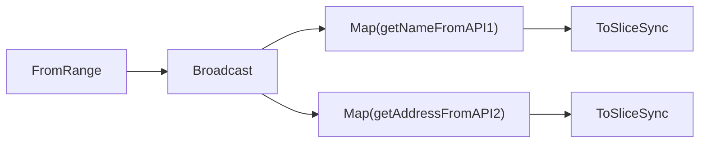

<h1>Asynchronous Sinks</h1>

All sink operators return Go channels. Take e.g. the `ToSlice` operator:

```go
func (input *Channel[T]) ToSlice() <-chan []T
```

It simply gathers elements from the input channel into a slice. The slice is sent to the returned Go channel when either the input channel is closed(so all elements would be in the slice) or the pipeline errors(a partial number of elements would be in the slice). So the typical way to use it is:

```go
channel := jpipe.FromRange(1, 1000)
names := <-jpipe.Map(channel, func(id int) string { getNameFromAPI(id) })
    .ToSlice()
```

But the typical way to use just synchronously reads the resulting slice from the channel. You could then argue that it would have been easier to have a synchronous `ToSliceSync`:

```go
func (input *Channel[T]) ToSliceSync() []T
```

But this synchronous version would be very limiting. Having the possibility to get result asynchronously comes handy in more complex scenarios. For starters, the synchronous version would not allow to have lazy pipeline execution:

```go
pipeline := jpipe.NewPipeline(ctx, jpipe.Config{Context: ctx, StartManually: true})
channel := jpipe.FromRange(1, 1000)
names := jpipe.Map(channel, func(id int) string { getNameFromAPI(id) })
    .ToSliceSync() // it would block here

pipeline.Start()
```

It's easy to see in the above snippet that the `ToSliceSync` call would block, and we would never get to start the pipeline.

<h3>Multi-sink pipelines</h3>

Pipelines with multiple sink operators are the best way to show the need for asynchronicity. Let's imagine we have a `ForEachAsync` operator and see it at work here:

```go
pipeline := jpipe.New(ctx)
channels := jpipe.FromRange(pipeline, 1, 1000).
    Broadcast(2, jpipe.Buffered(20))
names := jpipe.Map(pipeline, func(id int) string { return getNameFromAPI1(id) }, jpipe.Concurrent(10))
    .ToSliceSync()
addresses := jpipe.Map(pipeline, func(id int) string { return getAddressFromAPI2(id) }, jpipe.Concurrent(3))
    .ToSliceSync()
```

Broadcast is a more complex operator, so let's visualize the above pipeline:



Why would one resort to this complexity, instead of using a single `Map`(without `Broadcast`) and calling both APIs sequentially? A reason can be that you want to execute both APIs with different concurrency, maybe because each API has specific concurrency rate limits. That's why in this example, the first `Map` uses `jpipe.Concurrent(10)` and the second one uses `jpipe.Concurrent(3)`.

Back to the synchronicity issues, you can probably see the problem in the above code already. The first `ToSliceSync` makes the pipeline start. `Broadcast` sends all values to both output channels, and since it has `jpipe.Buffered(20)`, it will send the first 20 values. The first `ToSliceSync` processes 20 values, but the `Broadcast`'s second output channel is not being consumed yet, cause the second `ForEachAsync` hasn't even been created yet, and it won't be, cause execution is blocked waiting for the first `ToSliceSync` to complete. `Broadcast` is blocked at this point, so it won't send more values to either channel. The pipeline is then in a sort of deadlock.

The code is simply fixed by using the normal `ToSlice`:

```go
pipeline := jpipe.New(ctx)
channels := jpipe.FromRange(pipeline, 1, 1000).
    Broadcast(2, jpipe.Buffered(20))
namesChannel := jpipe.Map(pipeline, func(id int) string { return getNameFromAPI1(id) }, jpipe.Concurrent(10))
    .ToSlice()
addressesChannel := jpipe.Map(pipeline, func(id int) string { return getAddressFromAPI2(id) }, jpipe.Concurrent(3))
    .ToSlice()

names := <-namesChannel
addresses := <-addressesChannel

if pipeline.Error() != nil {
    fmt.Printf("Error: %v\n", pipeline.Error())
}
```

See how we check if there was a pipeline error, to be sure the results in `names` and `addresses` are not partial.