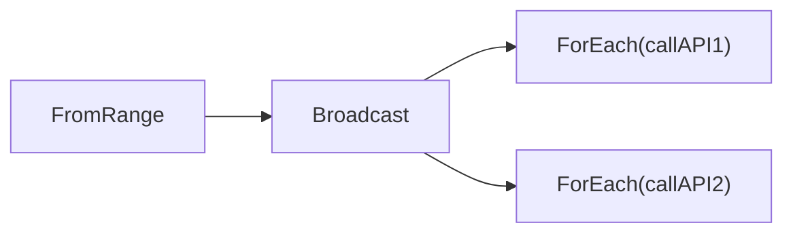

<h1>Lazy Execution</h1>

If you create a `Pipeline` with `jpipe.New(ctx)`, operators won't start working until a sink operator is created. Take e.g.:

```go
pipeline := jpipe.New(ctx)
channel := jpipe.FromRange(pipeline, 1, 1000).
    Filter(func(id int) bool { return !idExists(id) }).
    Take(5)
```

After the above snippet, nothing will be happening at all yet. `FromRange`, `Filter` and `Take` are waiting to be started. If you now add a sink operator:

```go
<-channel.ForEach(func(id int) { createEntityWithId(id) })
```

The pipeline will automatically start, and so will all operators.

This lazy behavior allows for the work to start at a well defined time. But also, it allows to "prepare" pipelines and pass them around as argument for someone else to consume them with a sink operator. In such a case, the consumer most probably wants the pipeline to start when the sink operator is added.

<h2>Starting pipelines manually</h2>

The prepared pipeline may contain the sink operator itself. In that case, auto-start would trigger execution before the pipeline consumer receives the pipeline.

```go
pipeline := jpipe.New(ctx, jpipe.Config{Context: ctx, StartAutomatically: false})
jpipe.FromRange(pipeline, 1, 1000).
    Filter(func(id int) bool { return !idExists(id) }).
    Take(5).
    ForEach(func(id int) { createEntityWithId(id) })

// scheduling the pipeline for future execution
time.After(5*time.Minute, pipeline.Start())
```

Notice how in the snippet above, if we had used `jpipe.New(ctx)`, the pipeline would have executed immediately, instead of after 5 minutes.

This whole concept of prepared pipelines can be better seen as the pipeline just being a blueprint of the actual processing. The pipeline defines data generation/flow/transformation, but actual execution is a separate step.

<h3>Multi-sink pipelines</h3>

Pipelines with multiple sinks are a good use case for manual starting. Let's see one such pipeline with automatic start:

```go
pipeline := jpipe.New(ctx)
channels := jpipe.FromRange(pipeline, 1, 1000).
    Broadcast(2, jpipe.Buffered(20))
<-channel[0].ForEach(func(id int) { callAPI1(id) }, jpipe.Concurrent(10))
// do other stuff
<-channel[1].ForEach(func(id int) { callAPI2(id) }, jpipe.Concurrent(3))
```

Broadcast is a more complex operator, so let's visualize the above pipeline:



Why would one resort to this complexity, instead of using a single `ForEach`(without `Broadcast`) and calling both APIs sequentially? A reason can be that you want to execute both APIs with different concurrency, maybe because each API has specific concurrency rate limits. That's why in this example, the first `ForEach` uses `jpipe.Concurrent(10)` and the second one uses `jpipe.Concurrent(3)`.

Back to the auto-start subject, you can see how in this example the pipeline would start after the first `ForEach` is created. So there's no way in a pipeline like this to make the full pipeline start at the same time. This may not be an issue in many cases, but such control may be desired. Notice the `// do other stuff` comment between both `ForEach`s. That may be some long operation that is must be run before creating the second `ForEach`. If automatic start was used, the second `ForEach` may start working significantly after the first one.